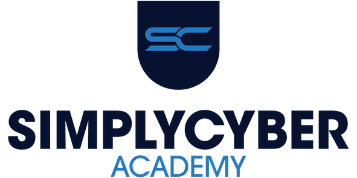
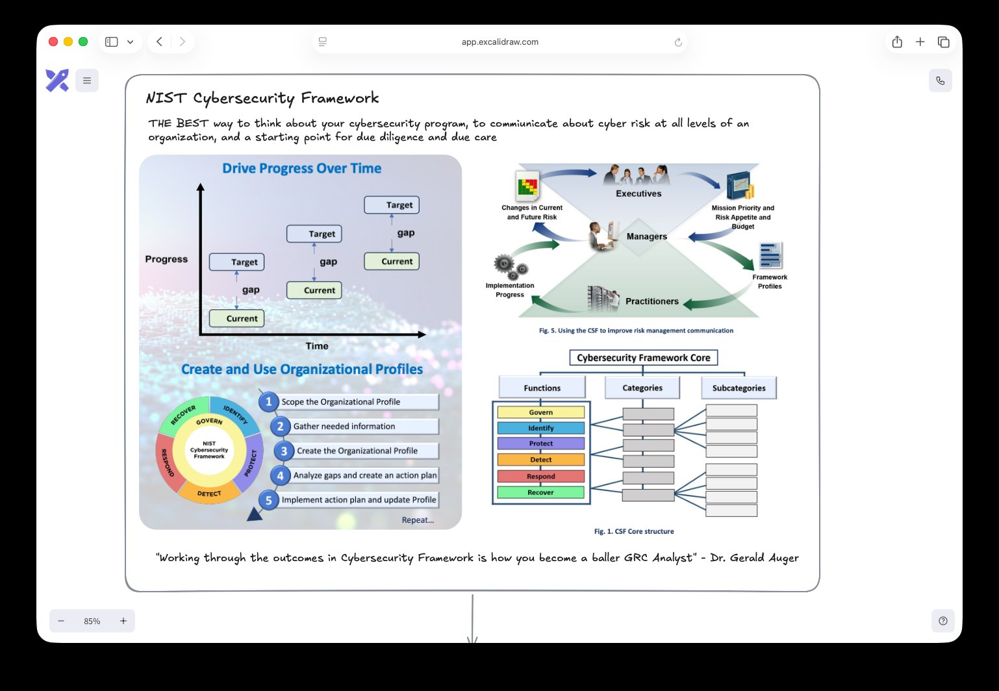
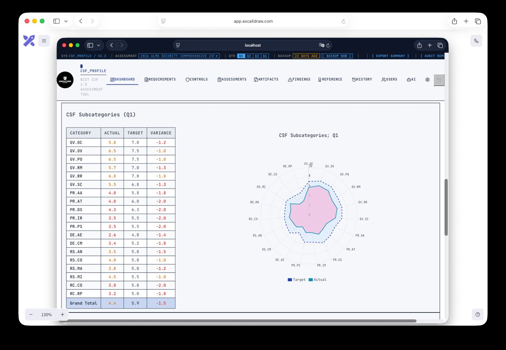
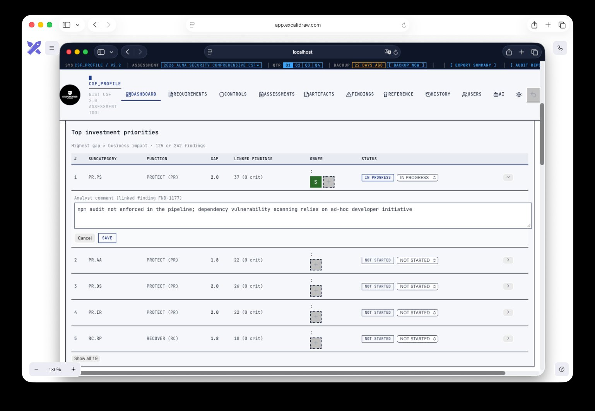
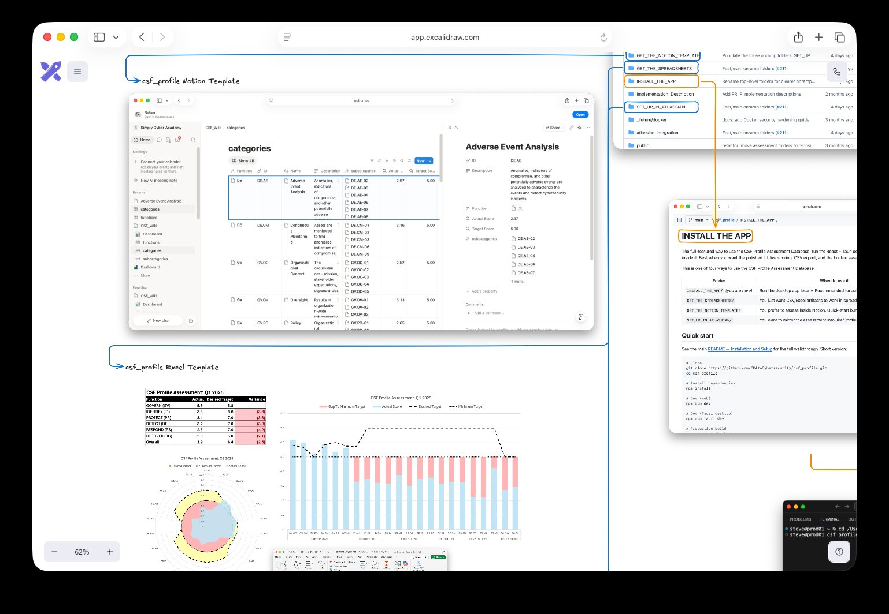
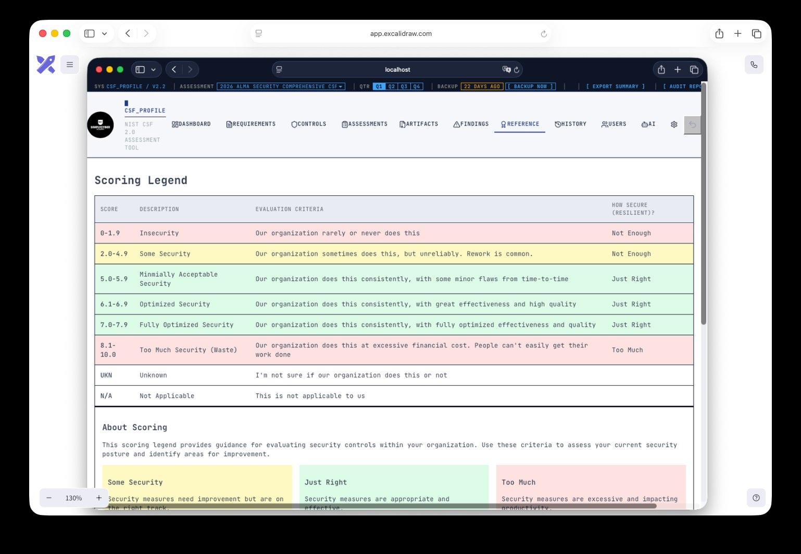
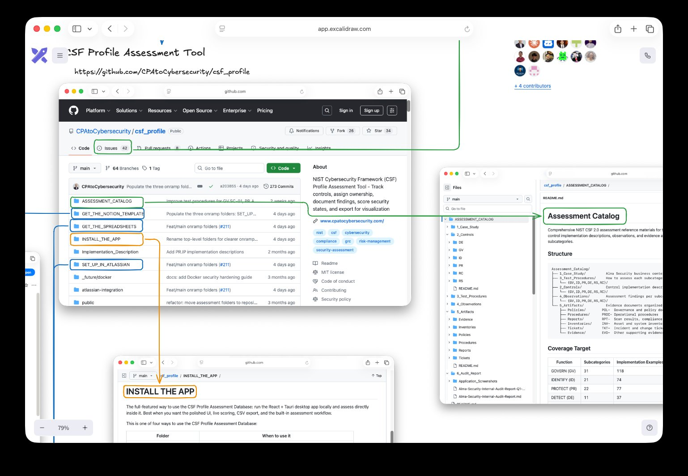
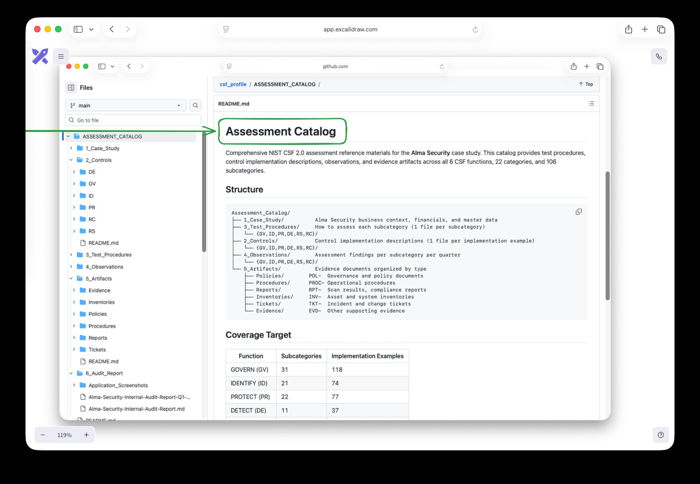
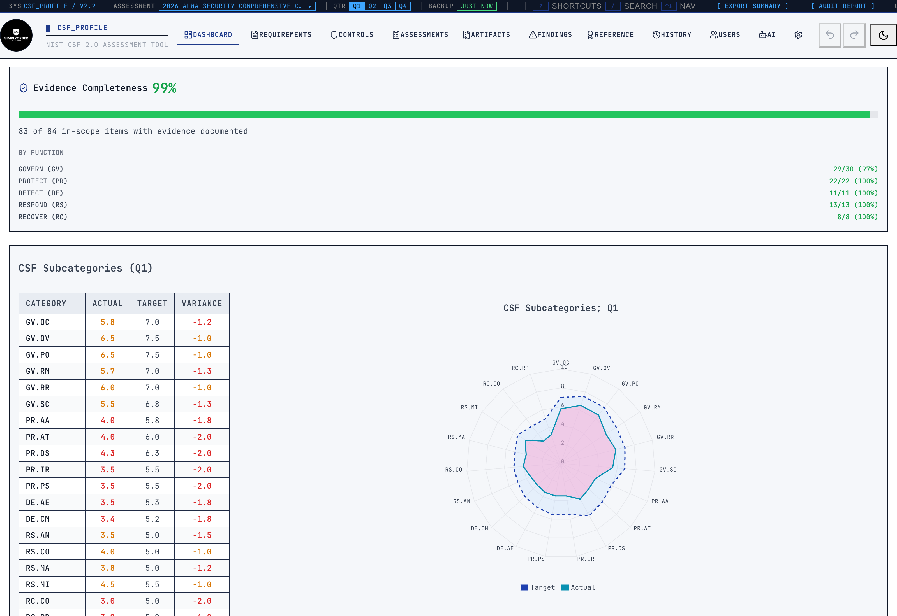
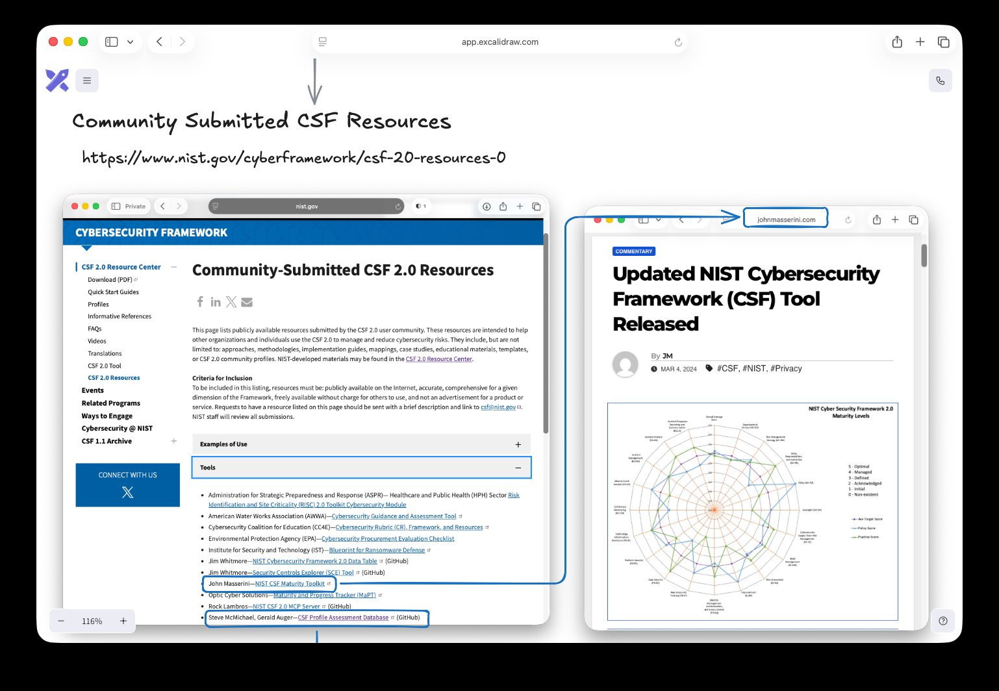

# CSF Profile — Free, Open-Source NIST CSF 2.0 Assessment Tool

A free, open-source, self-hosted toolkit for running NIST Cybersecurity Framework (CSF) 2.0 profile assessments — a lightweight alternative to commercial GRC platforms. Track outcomes, assign ownership, document observations and findings, score current and target states, and export for visualization. All locally, with your data staying on your machine.

**[🚀 Try the Live Demo](https://csf-profile-app.pages.dev)** — no install required. Explore a populated assessment of the fictional company "Alma Security" in seconds.

## Your Capstone in 5 Steps

Building your GRC portfolio artifact for a Simply Cyber Academy course? Here's the whole arc:

1. **Open the app** — [csf-profile-app.pages.dev](https://csf-profile-app.pages.dev) (no install), or pick another door below.
2. **Explore the sample** — a comprehensive CSF 2.0 assessment for fictional "Alma Security" is pre-loaded; check the Dashboard radar to see where you're headed.
3. **Score your scope** — pick your subcategories and score current vs. target state using the built-in [0-10 scoring legend](#scoring-system).
4. **Document observations and findings** — record what you examined, who you interviewed, what you tested, and link evidence artifacts.
5. **Export and report** — export your CSV workpapers and write up results; use the [example audit report](ASSESSMENT_CATALOG/6_Audit_Report/) as your template. That deliverable is your portfolio piece.



## 🏛️ As Seen On NIST.gov

[](https://youtube.com/shorts/Zf-84mT17VQ)

> **👆 Click the image above** to view a short explainer video.

## 🎬 As Seen On CISO Tradecraft!


[](https://www.youtube.com/watch?v=4uI-tsaLWaI&t=1808s)

> **👆 Watch the overview** with G Mark Hardy.

[](https://app.excalidraw.com/l/1U6BgkXrdYQ/tLdWtKGDaG)

> **👆 Click the image above** to check out the walkthrough on Excalidraw.

### Tap through the tour

<table>
  <tr>
    <td align="center" width="25%"><a href="public/screenshots/01-nist-csf-overview.png"></a><br><sub><b>NIST CSF Overview</b></sub></td>
    <td align="center" width="25%"><a href="public/screenshots/02-community-submitted-csf-resources.png"></a><br><sub><b>Community Submitted Resource</b></sub></td>
    <td align="center" width="25%"><a href="public/screenshots/03-github-repo-overview.png"></a><br><sub><b>GitHub Repo</b></sub></td>
    <td align="center" width="25%"><a href="public/screenshots/04-assessment-catalog.png"></a><br><sub><b>Assessment Catalog</b></sub></td>
  </tr>
  <tr>
    <td align="center" width="25%"><a href="public/screenshots/05-notion-and-excel-templates.png"></a><br><sub><b>Notion &amp; Excel Templates</b></sub></td>
    <td align="center" width="25%"><a href="public/screenshots/06-app-scoring-legend.png"></a><br><sub><b>Scoring Legend</b></sub></td>
    <td align="center" width="25%"><a href="public/screenshots/07-app-dashboard-radar.png"></a><br><sub><b>Dashboard &amp; Radar</b></sub></td>
    <td align="center" width="25%"><a href="public/screenshots/08-app-investment-priorities.png"></a><br><sub><b>Priority Gaps</b></sub></td>
  </tr>
</table>

<p align="center">
  <a href="https://link.excalidraw.com/l/1U6BgkXrdYQ/tLdWtKGDaG"><b>🔗 Open the full walkthrough →</b></a>
</p>

**[More Screenshots](SCREENSHOTS.md)** - See the application in action

## 🚪 Choose Your Door

The same NIST CSF 2.0 guidance, flattened into proper tables, ships in five formats. Pick the one that fits how you work — you don't need to install the app to get value from this repo:

| Door | Best for | Start here |
|------|----------|------------|
| 📊 **Spreadsheets** | Excel / Power Query users; feeding your AI assistant; zero-tooling quick start | [GET_THE_SPREADSHEETS/](GET_THE_SPREADSHEETS/) |
| 📝 **Notion template** | Individuals and small teams who want a free, dynamic CSF database — no GRC tool budget needed | [GET_THE_NOTION_TEMPLATE/](GET_THE_NOTION_TEMPLATE/) |
| 🧩 **Jira + Confluence** | Atlassian shops who want assessments, artifacts, and findings as real tickets and pages | [SET_UP_IN_ATLASSIAN/](SET_UP_IN_ATLASSIAN/) |
| 💻 **React app** | Consultants and analysts who want a guided assessment workflow ([or just try the demo](https://csf-profile-app.pages.dev)) | [INSTALL_THE_APP/](INSTALL_THE_APP/) or [Installation](#installation-and-setup) below |
| 🎓 **Practice case study** | Career-changers building a GRC portfolio — run a full assessment of fictional "Alma Security" | [ASSESSMENT_CATALOG/](ASSESSMENT_CATALOG/) |

## 🤝 Contributing

This project is intentionally a first-contribution-friendly repo for GRC practitioners and career-changers — **including contributions that require no code at all** (test procedures, assessment artifacts, case-study findings, documentation). Coders are equally welcome: features, bug squashes, and UI improvements are labeled in [Issues](https://github.com/CPAtoCybersecurity/csf_profile/issues).

👉 Start with [CONTRIBUTING.md](CONTRIBUTING.md) — it has two tracks: **Contribute Without Code** and **Contribute Code**. Filter issues by [`good first issue`](https://github.com/CPAtoCybersecurity/csf_profile/issues?q=is%3Aissue+is%3Aopen+label%3A%22good+first+issue%22) to find a starting point, and add your name to [CONTRIBUTORS.md](CONTRIBUTORS.md) with your first merged PR.

Find in depth videos for CSF profile assessments and this tool in Simply Cyber Academy here: [https://academy.simplycyber.io/p/accrp](https://academy.simplycyber.io/p/accrp)

## Installation and Setup

### Walkthrough:

[](https://youtu.be/xWo9owjk75c)

### Installation:

[](https://youtu.be/h206z7wIYqY)

### Prerequisites by Operating System

#### macOS

macOS typically comes with Git pre-installed. You only need to install Node.js:

1. Download and install Node.js from [nodejs.org](https://nodejs.org/) (LTS version recommended)
2. Verify installation by opening Terminal and running:

   ```
   node --version
   npm --version
   ```

#### Windows

1. **Install Git first**: Download and install Git from [git-scm.com](https://git-scm.com/download/win)

   * During installation, you can accept the default options
2. **Install Node.js**: Download the MSI installer from [nodejs.org](https://nodejs.org/) (LTS version recommended)

   * Run the MSI installer and follow the prompts
3. **Open PowerShell** to run the installation commands below

   * Press `Win + X` and select "Windows PowerShell" or search for "PowerShell" in the Start menu

#### Kali Linux / Debian-based Linux

1. Update your package manager and install Node.js:

   ```bash
   sudo apt update
   sudo apt install nodejs npm git
   ```

### Installation Steps

1. **Clone the repository**

   ```
   git clone https://github.com/CPAtoCybersecurity/csf_profile
   cd csf_profile
   ```

2. **Install dependencies**

   ```
   npm install
   ```

3. **Start the development server**

   ```
   npm start
   ```

4. **Access the application**
   Open your browser and navigate to [http://localhost:3000](http://localhost:3000)

## Encrypted Exports (.enc.csv)

Some exports support optional password protection. If you provide a password, the downloaded file will be named like:

- `assessments_YYYY-MM-DD.enc.csv`

This is an encrypted file format intended for secure backup/storage. It will not open directly in Excel/VS Code.

### How to decrypt

Use the provided Node script to decrypt an encrypted export back into a regular CSV:

**Note:** The script works on modern Node versions (Node 18+ recommended). On Node 22+ `globalThis.crypto` is read-only; the script handles this internally.

```bash
node scripts/decrypt-export.mjs --in <input.enc.csv> --out <output.csv>
```

Example:

```bash
node scripts/decrypt-export.mjs --in assessments_2026-01-19.enc.csv --out assessments_2026-01-19.csv
```

If the password is wrong (or the file is modified), decryption will fail.

Security note: Passing `--password` on the command line may save it in your shell history. If needed for automation, you can still provide `--password "..."`.

### Environment Variables Configuration (Optional)

The application supports integration with JIRA and Confluence for enhanced tracking capabilities. To enable these integrations, you'll need to configure environment variables with your API credentials.

#### Setting Up Environment Variables

1. **Copy the example file:**
   ```bash
   cp .env.example .env
   ```

2. **Edit the `.env` file** and add your credentials:
   - `REACT_APP_JIRA_INSTANCE_URL` - Your JIRA instance URL (e.g., https://your-domain.atlassian.net)
   - `REACT_APP_JIRA_API_TOKEN` - Your JIRA API token
   - `REACT_APP_CONFLUENCE_INSTANCE_URL` - Your Confluence URL (e.g., https://your-domain.atlassian.net/wiki)
   - `REACT_APP_CONFLUENCE_API_TOKEN` - Your Confluence API token

3. **Generate API tokens** at: https://id.atlassian.com/manage-profile/security/api-tokens

#### Claude AI Assistant (server-side key)

The AI Assistant's Claude integration is configured **on the backend only** — the browser never sees or stores the API key:

- `CLAUDE_API_KEY` - Your Anthropic API key (used by the backend proxy at `/api/ai/claude`)
- `CLAUDE_MODEL` - Optional model override (defaults to `claude-sonnet-4-20250514`)

Set these in the backend environment (or `.env`) and restart the server. The frontend shows a "Ready" badge when the key is configured (via `GET /api/ai/status`, which returns a boolean only). Without a key, Claude requests return a mock response so local development still works.

#### Windows-Specific Instructions

For local development on Windows, you can set environment variables using PowerShell or Command Prompt:

**Using PowerShell:**
```powershell
# Set environment variables for current session
$env:REACT_APP_JIRA_INSTANCE_URL="https://your-domain.atlassian.net"
$env:REACT_APP_JIRA_API_TOKEN="your-jira-token"
$env:REACT_APP_CONFLUENCE_INSTANCE_URL="https://your-domain.atlassian.net/wiki"
$env:REACT_APP_CONFLUENCE_API_TOKEN="your-confluence-token"

# Then start the app
npm start
```

**Using Command Prompt:**
```cmd
set REACT_APP_JIRA_INSTANCE_URL=https://your-domain.atlassian.net
set REACT_APP_JIRA_API_TOKEN=your-jira-token
set REACT_APP_CONFLUENCE_INSTANCE_URL=https://your-domain.atlassian.net/wiki
set REACT_APP_CONFLUENCE_API_TOKEN=your-confluence-token
npm start
```

**Recommended: Using a `.env` file (All platforms)**

The easiest approach for all platforms is to use a `.env` file in the project root:

1. Copy `.env.example` to `.env`
2. Edit `.env` and fill in your values
3. The `.env` file is automatically excluded from version control
4. Run `npm start` as normal

**Important Security Notes:**
- Never commit your `.env` file to version control
- Never share your API tokens publicly
- Rotate tokens periodically for security
- The `.env` file is already listed in `.gitignore` to prevent accidental commits

### Troubleshooting (Kali Linux)

If you encounter issues with `react-scripts` not installing correctly on Kali Linux:

1. **Delete node_modules and reinstall:**

   ```bash
   cd csf_profile
   rm -rf node_modules
   rm package-lock.json
   npm install
   ```

2. **If issues persist**, try installing with the `--legacy-peer-deps` flag:

   ```bash
   npm install --legacy-peer-deps
   ```

3. **Verify react-scripts is installed:**

   ```bash
   ls node_modules/.bin/ | grep react-scripts
   ```

#### Docker Support (Coming Soon)

Docker support is planned for a future release. Draft Docker files are available in `_future/docker/` for reference. These require updates for production use with the new backend integration.

*Contributed by [@SecBurg](https://github.com/SecBurg)*

## Confluence Cloud Integration

This application supports fetching control documentation from **Confluence Cloud** using a secure backend integration.

### Required Environment Variables

Set the following environment variables in your backend `.env` file:

```env
CONFLUENCE_BASE_URL=https://your-company.atlassian.net
CONFLUENCE_EMAIL=your-email@example.com
CONFLUENCE_API_TOKEN=your-api-token
```

## Integration Options

This project supports two paths depending on your infrastructure needs:

### Standard Path (Main Branch)
File-based exports for users without backend infrastructure:
- **CSV Export**: Import into Excel, Google Sheets, or any spreadsheet tool
- **JSON Export**: Import into Jira via Jira Importers plugin, or use with other tools
- **No backend required** - runs entirely in the browser

### Advanced Path (feature/api-integration Branch) - *Pre-Alpha*
> **Status**: In active development. Not recommended for production use.

Real-time API integration for teams with infrastructure support:
- **Jira Cloud API**: Create issues directly from assessment findings
- **Confluence Cloud API**: Link control documentation and sync content
- **Requires backend service** for OAuth/token handling

See the [feature/api-integration branch](https://github.com/CPAtoCybersecurity/csf_profile/tree/feature/api-integration) for development progress.

## Features

### CSV Import and Export

#### Export CSV

The Export CSV function allows you to:

* Export your entire assessment database to a CSV file
* Include all control details, observations, scores, and action plans
* Generate date-stamped files for version control
* Add it to the companion Excel template for reporting

To export your data, click the "Export CSV" button in the controls view. The file will be automatically downloaded with a filename that includes the current date.

#### Import CSV

The Import CSV function allows you to:

* Import assessment data from a CSV file
* Update your assessment with data from external sources
* Restore from a previous export
* Collaborate by sharing and merging assessment files

**Important Note:** Importing a CSV will overwrite all data currently in the database. Make sure to export your current data first if you want to preserve it. CSV files are particularly useful for creating charts and visualizations in Excel or other spreadsheet applications.

## Navigation

The application includes several key sections:

* **Subcategories**: View and manage all CSF controls
* **Dashboard**: Visualize assessment data and progress
* **Scoring**: Reference the scoring legend and methodology
* **Artifacts**: Audit artifacts with links, to map to CSF subcategories for "test once - assure many" efficiencies
* **User Management**: Manage users involved in the assessment

## Scoring System

The tool uses a scoring system from 0-10 to assess the current and desired state of each control. It comes from the Mastering Cyber Resilience textbook by AKYLADE.

* **0-1.9**: Insecurity - Organization rarely or never implements this control
* **2.0-4.9**: Some Security - Organization sometimes implements this control, but unreliably
* **5.0-5.9**: Minimally Acceptable Security - Organization consistently implements this control with minor flaws
* **6.1-6.9**: Optimized Security - Organization consistently implements this control with great effectiveness
* **7.0-7.9**: Fully Optimized Security - Organization implements this control with fully optimized effectiveness
* **8.1-10.0**: Too Much Security - Organization implements this control at excessive financial cost

## Jira / Confluence Setup and Configuration

### Proof-of-Concept (Free Tier)

1. **Obtain API Tokens**

   * Jira Cloud: [https://id.atlassian.com/manage/api-tokens](https://id.atlassian.com/manage/api-tokens)
   * Confluence Cloud: same token can be used
2. **Required Permissions**

   * Jira: Browse Projects, Edit Issues, Create Issues
   * Confluence: View and Add Content, Edit Pages
3. **Environment Variables (.env)**

```
JIRA_BASE_URL=https://your-domain.atlassian.net
JIRA_EMAIL=your-email@example.com
JIRA_API_TOKEN=your-jira-api-token
CONFLUENCE_BASE_URL=https://your-domain.atlassian.net/wiki
```

### Production Setup (Company Instances)

1. **Service Account** with minimum required permissions
2. Store API tokens securely (do not commit to repo)
3. Set environment variables on server

### Optional: EntraID / SSO Integration

* Configure SSO in Jira/Confluence if company uses Microsoft EntraID

### Common API Troubleshooting

* `401 Unauthorized`: Invalid token or email mismatch
* `403 Forbidden`: Missing permissions
* `Invalid URL`: Ensure `/wiki` path is included for Confluence
* `Rate Limits`: Reduce request frequency or batch requests

## Contributors

Thank you to our amazing contributors! See [CONTRIBUTORS.md](CONTRIBUTORS.md) for the full list.

## About

CSF Profile Assessment Database **v2.2**, from the **Simply Cyber Academy** community.


This is an open source project, and improvement ideas to drive cyber risk reduction with CSF assessments are welcome from the Simply Cyber and other awesome communities.

## Credit

This tool is based on the NIST Cybersecurity Framework (CSF), developed by the National Institute of Standards and Technology. The framework and implementation examples that make up the basis of this assessment are sourced from [NIST.gov](https://www.nist.gov/cyberframework). We acknowledge and appreciate NIST's work in creating this valuable resource for improving cybersecurity risk management.

As a demonstration of how to conduct CSF profile assessment, fictional company "Alma Security" is used, inspired by Daniel Miessler's open source Telos project here: [https://github.com/danielmiessler/Telos/blob/main/corporate_telos.md](https://github.com/danielmiessler/Telos/blob/main/corporate_telos.md)

## Disclaimer

This software is provided under the MIT License. [https://github.com/CPAtoCybersecurity/csf_profile/blob/main/LICENSE](https://github.com/CPAtoCybersecurity/csf_profile/blob/main/LICENSE)

By using this tool, you agree to the following:

```
THE SOFTWARE IS PROVIDED "AS IS", WITHOUT WARRANTY OF ANY KIND, EXPRESS OR
IMPLIED, INCLUDING BUT NOT LIMITED TO THE WARRANTIES OF MERCHANTABILITY,
FITNESS FOR A PARTICULAR PURPOSE AND NONINFRINGEMENT. IN NO EVENT SHALL THE
AUTHORS OR COPYRIGHT HOLDERS BE LIABLE FOR ANY CLAIM, DAMAGES OR OTHER
LIABILITY, WHETHER IN AN ACTION OF CONTRACT, TORT OR OTHERWISE, ARISING FROM,
OUT OF OR IN CONNECTION WITH THE SOFTWARE OR THE USE OR OTHER DEALINGS IN THE
SOFTWARE.
```

The CSF Profile Assessment Database is intended for educational and informational purposes only. While efforts have been made to ensure accuracy and functionality, this tool does not guarantee compliance with any regulatory requirements or complete protection against cybersecurity threats. Users implement this software at their own risk.

The creator and contributors of this project cannot be held liable for any damages, data loss, or security incidents that may occur through the use of this tool. Organizations should verify all assessment findings independently and consult with qualified cybersecurity professionals when making security decisions.

By downloading, installing, or using this tool, you acknowledge that you understand these risks and accept full responsibility for any outcomes resulting from its use.
