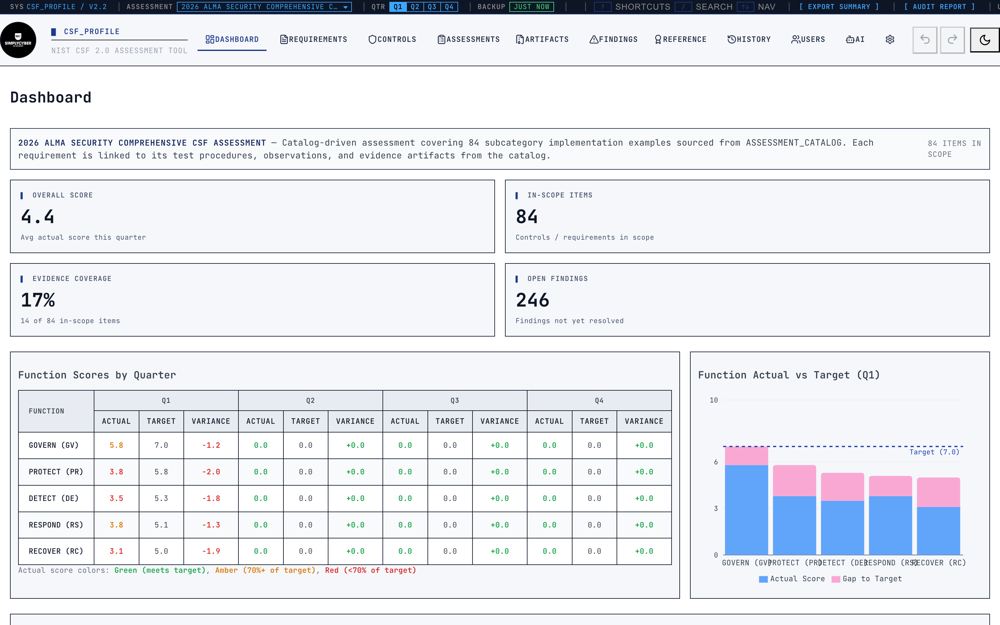
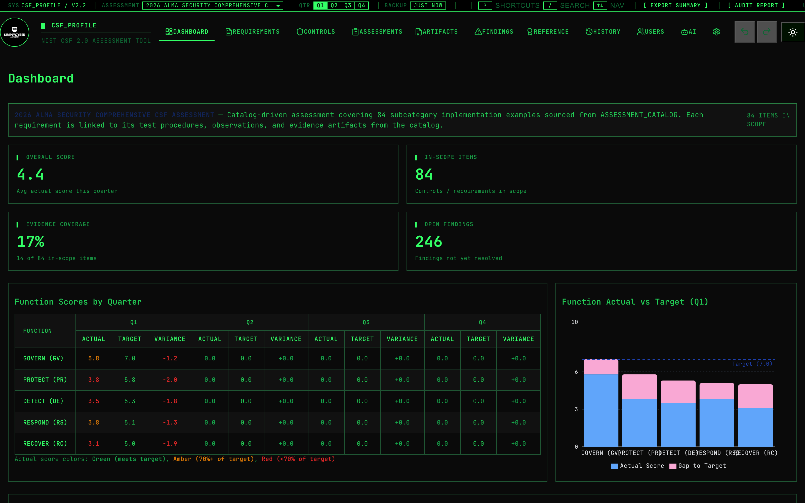
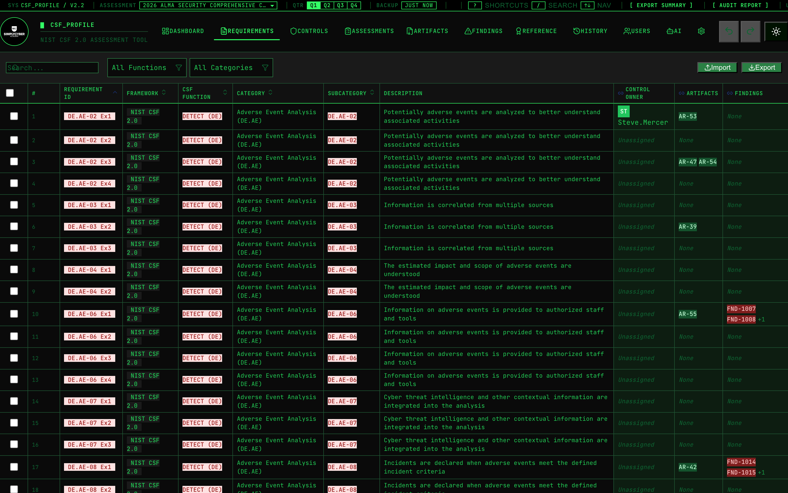
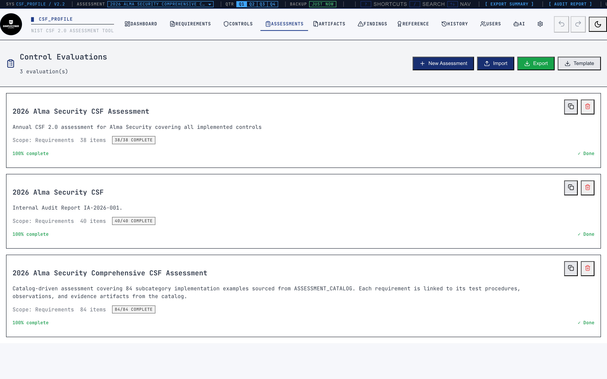
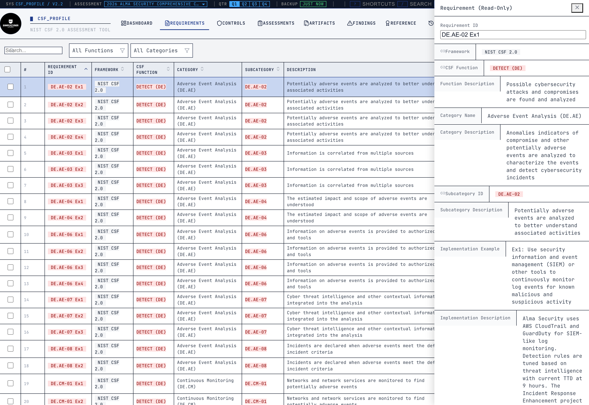
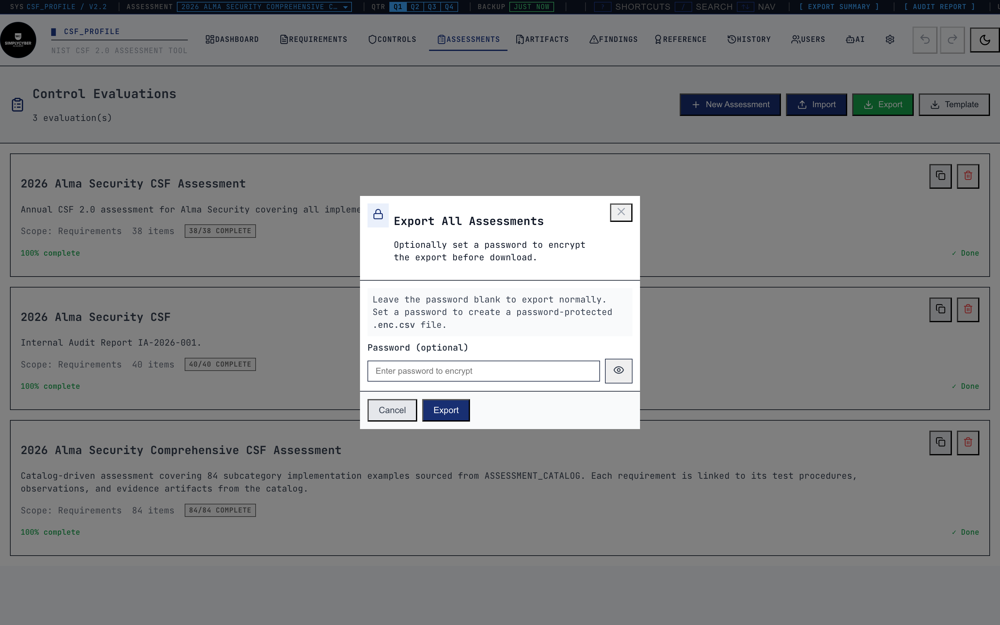
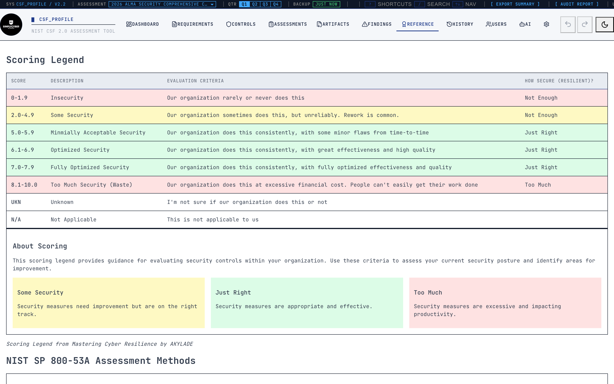
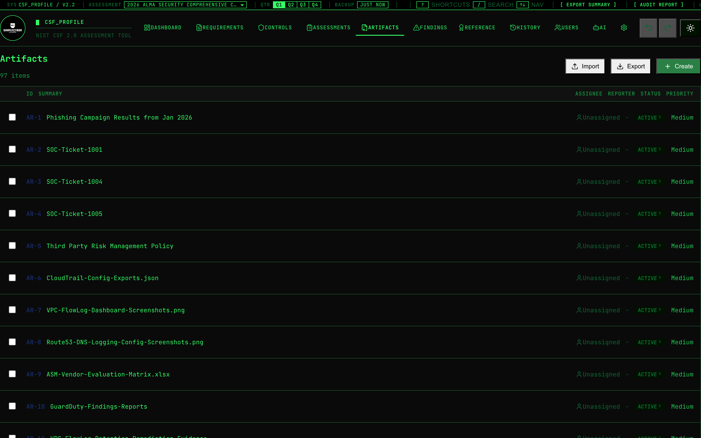
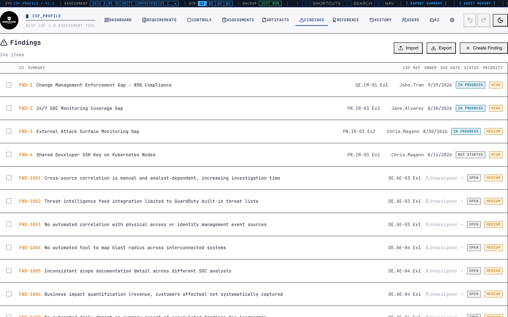
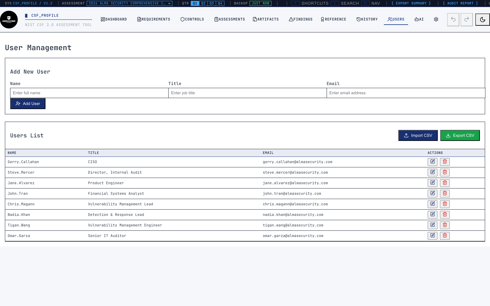

# CSF Profile Assessment Database - Screenshots

## Dashboard

The Dashboard provides visual analytics including:
- **Function Scores by Quarter** - Pivot table showing Actual, Target, and Variance scores for each CSF function
- **Function Actual vs Target** - Bar chart comparing actual scores against targets with gap visualization
- **CSF Subcategories** - Radar chart and detailed subcategory breakdown

---

## Requirements & Implementation Descriptions

The Requirements page is the primary interface for managing CSF assessment data. Features include:
- Sortable and filterable table of all implementation examples
- Quick status indicators for In Scope and completion status
- Import/Export CSV functionality
- Detailed side panel for viewing and editing individual items

---

## Assessments (Control Evaluations)

Manage multiple assessments side by side — each with its own scope, completion tracking, and import/export. The pre-loaded Alma Security assessments demonstrate the full workflow.

## Requirement Detail Panel

Click any requirement row to open the detail panel: framework mapping, category and subcategory descriptions, the NIST implementation example, and the documented implementation with quarterly observations.

---

## Encrypted Exports (Optional Password Protection)

Some exports support optional password protection. When you choose to encrypt an export, the app prompts you for a password and downloads an encrypted file with an `.enc.csv` suffix. This is intended for secure storage/backup and will not open directly in Excel or a text editor until it is decrypted.

---
## Scoring Legend (Reference Tab)

The Scoring Legend provides guidance for evaluating security controls using the scoring system from Simply Cyber Academy. Color-coded rows indicate security posture: yellow for "Some Security," green for "Just Right," and red for insufficient or excessive security.

---

## Evidence

The Evidence page manages audit artifacts that support assessment findings. Features include:
- Artifact ID, Name, and Description
- External links to evidence documents
- Linked Subcategory IDs for "test once, assure many" efficiency
- Import/Export functionality

---

## Findings & Remediation

Track findings and their remediation for controls that need improvement:
- Priority, status, and root cause per finding
- Remediation owner assignment and due dates
- Detailed remediation action plans

---

## User Management

Manage users involved in the assessment process:
- Add new users with Name, Title, and Email
- Import/Export user lists via CSV
- Users can be assigned as Owners, Stakeholders, Auditors, or Remediation Owners

