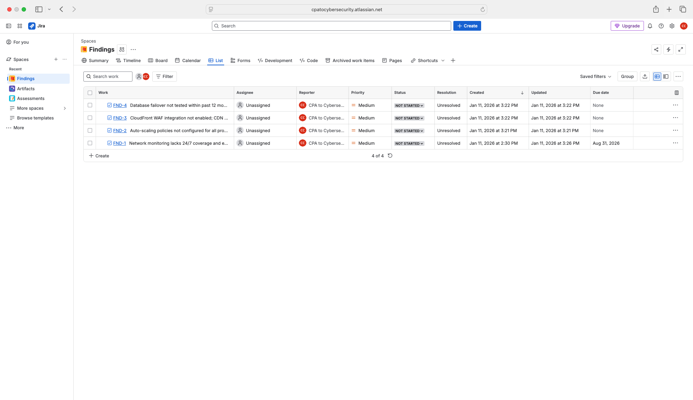
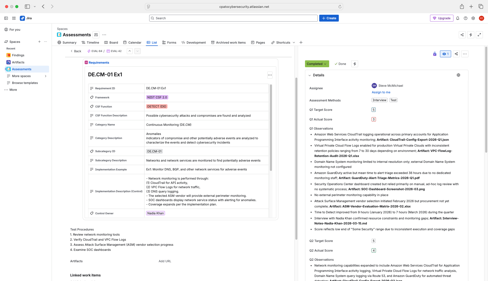
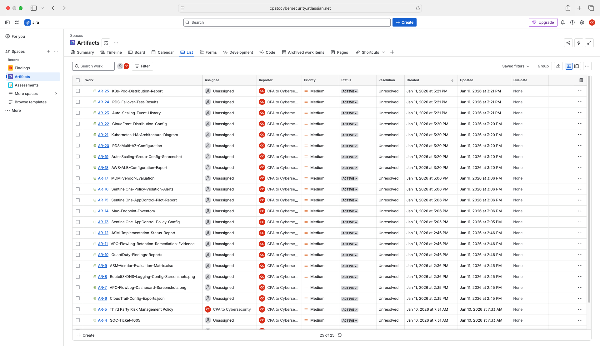
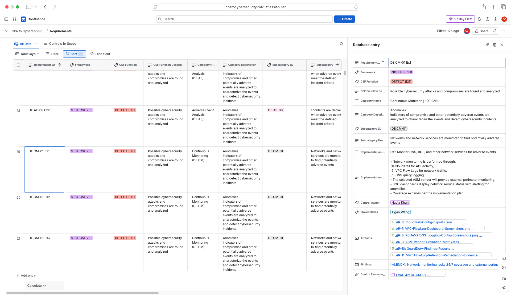

# SET UP IN ATLASSIAN

Run your CSF Profile assessment lifecycle inside **Atlassian Jira + Confluence** instead of (or alongside) the local React app. Best when your team already lives in Atlassian, when you need work-paper-grade audit trails, or when you want one place for execution (Jira) and documentation (Confluence).

This is one of four ways to use the CSF Profile Assessment Database. Where this folder fits:

| Folder | When to use it |
|---|---|
| `INSTALL_THE_APP/` | Run the desktop app locally. Most polished UI. |
| `GET_THE_SPREADSHEETS/` | Excel/CSV only. No app, no Atlassian. |
| `GET_THE_NOTION_TEMPLATE/` | Run your assessment inside Notion. |
| **`SET_UP_IN_ATLASSIAN/`** *(you are here)* | Run it inside Jira + Confluence. |

## How to use this folder

The work splits cleanly into **set up** (once, ~30 min) and **load data** (every time you start a new assessment cycle).

### Step 1 — Set up Atlassian (once)

Follow **[`ATLASSIAN-SETUP.md`](ATLASSIAN-SETUP.md)** to:
- create a free Atlassian Cloud site
- generate an API token (only needed for the CLI path)
- create a Confluence space for CSF documentation
- create a Jira project shell for assessments

### Step 2 — Pick a way to load data and run assessments

| Path | File | When |
|---|---|---|
| **Manual native import** | [`LOAD-DATA-MANUALLY.md`](LOAD-DATA-MANUALLY.md) | You want zero AI/CLI dependencies. Upload the CSVs from `../GET_THE_SPREADSHEETS/` straight into Jira and Confluence. |
| **Claude cowork (browser-driven)** | [`LOAD-DATA-WITH-CLAUDE-COWORK.md`](LOAD-DATA-WITH-CLAUDE-COWORK.md) | You have Claude for Chrome or claude.ai with computer use and you'd rather have Claude drive the Jira UI than click through it yourself. |
| **CLI toolkit (power user)** | [`LOAD-DATA-WITH-CLI.md`](LOAD-DATA-WITH-CLI.md) | You want bidirectional sync, can run Node, and don't mind generating an API token. Bridges the React app's JSON export to Atlassian. |

The three paths are not mutually exclusive — start manual, graduate to CLI, sprinkle in cowork as needed.

## What success looks like

After setup + load, your Confluence space holds the Requirements/Controls databases and your Jira project holds the assessment work papers. Screenshots in this folder show the result:

-  — Jira issues tagged as Findings, with status workflow
-  — Assessment work papers with quarterly scoring
-  — Evidence artifacts linked to controls
-  — Confluence-side reference databases

## Free vs. paid Atlassian Cloud

The free tier (10 users, unlimited projects, unlimited Confluence spaces, databases included) covers everything in this folder. You only need a paid plan if you exceed 10 users.
